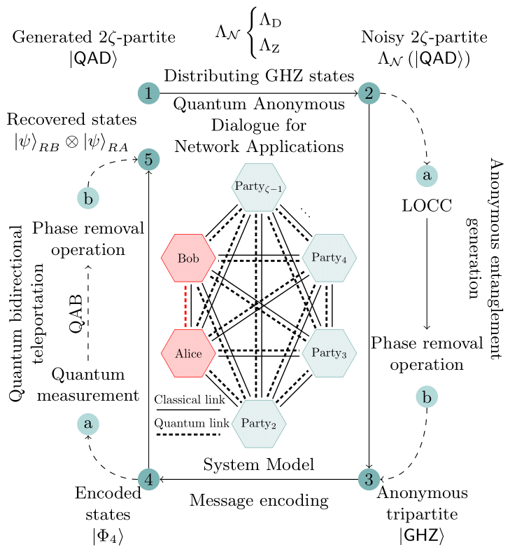
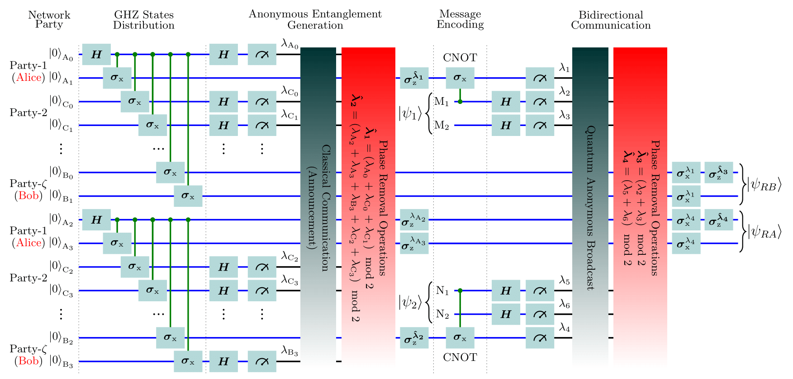

# Quantum Anonymous Dialogue - Simulation

This project simulates a Quantum Anonymous Dialogue (QAD) protocol using the NetSquid simulation platform to prove the correctness of the protocol. The simulation evaluates the performance of the QAD protocol in the presence of depolarizing and dephasing noise, focusing on the fidelity of the generated anonymous GHZ state and the fidelity of transmitted messages.

## Overview

We proposed an integrated framework incorporating quantum anonymity with bidirectional quantum
teleportation for quantum anonymous dialogue, where two tripartite anonymous entanglements are prepared between two communicating network parties to transmit quantum messages simultaneously. The Greenberger–Horne–Zeilinger (GHZ) state is utilized as a resource to prepare the anonymous entanglement by performing local operations and classical communication (LOCC) on the GHZ state. Then, the communicating parties encode their messages into the generated anonymous entanglements. These encoded messages are transmitted by performing quantum measurements and announcing the classical measurement results. The quantum anonymous broadcast (QAB) protocol facilitates the anonymous announcements of classical results to all participants, enabling the sharing of information while preserving the privacy and anonymity of the communicating parties. This integrated framework promises to achieve both privacy and transmission efficiency with diverse network applications. 

## QAD System Model

## QAD Framework

